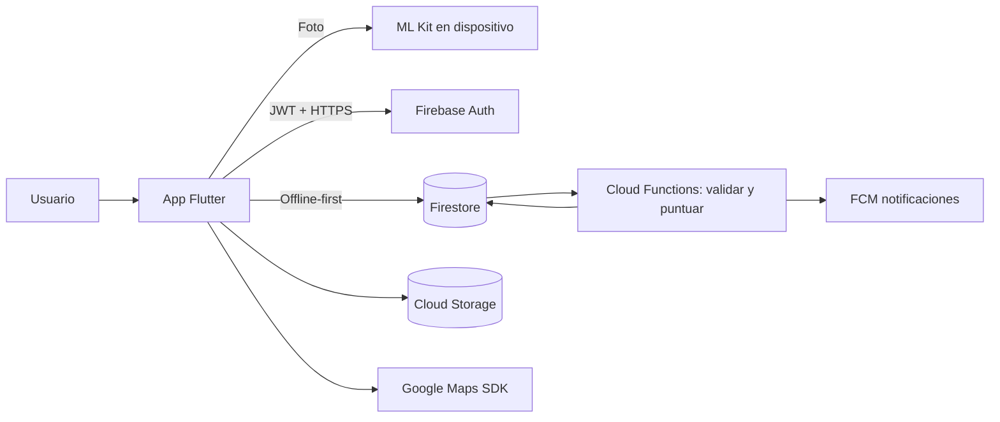

# Arquitectura

```mermaid
flowchart LR
  U[Usuario] --> A[App Flutter]
  A -->|Foto| ML[ML Kit en dispositivo]
  A -->|JWT + HTTPS| AU[Firebase Auth]
  A -->|Offline-first| FS[(Firestore)]
  A --> ST[(Cloud Storage)]
  FS --> CF[Cloud Functions: validar y puntuar]
  CF --> FS
  CF --> FCM[FCM notificaciones]
  A --> MP[Google Maps SDK]
```
